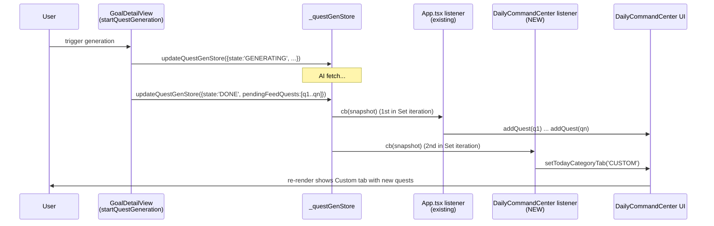

# Design Document

## Overview

This feature adds automatic switching of `DailyCommandCenter`'s `todayCategoryTab` from `DEFAULT` to `CUSTOM` after a quest creation flow that produces at least one Custom_Quest, while leaving the tab untouched in every other scenario.

Two separate triggers must auto-switch:
1. **Manual quest creation** — `handleCreate` inside `DailyCommandCenter.tsx` (one-time custom quest path).
2. **Goal-based generation** — the `'DONE'` transition emitted by the `_questGenListeners` Set in `components/GoalDetailView.tsx`, which is currently consumed by an `App.tsx`-level listener that dispatches `addQuest` for each `pendingFeedQuests` entry.

The chosen approach is **lowest-impact**: no new global state, no new emitter, no prop changes from `App.tsx`. The manual switch is a single conditional `setTodayCategoryTab('CUSTOM')` inside `handleCreate`, and the goal-gen switch is a new `useEffect` inside `DailyCommandCenter` that subscribes to the existing `onQuestGenStoreUpdate` emitter strictly to read state — it never calls `addQuest` (the existing `App.tsx` listener retains sole responsibility for dispatch).

The key insight that makes this safe: `_questGenListeners` is a JavaScript `Set`, which iterates in **insertion order**. `App.tsx` mounts and registers its listener long before `DailyCommandCenter` does. So within a single `updateQuestGenStore(...)` call, the synchronous `forEach` invokes `App.tsx`'s callback (which calls `addQuest` for every `pendingFeedQuests` item) **before** `DailyCommandCenter`'s callback (which calls `setTodayCategoryTab('CUSTOM')`). React batches both setters into the same render cycle, so on the next render the new quests are present in `quests` and the active tab is `CUSTOM`.

## Architecture

### Where the logic lives

| Concern | Owner | Mechanism |
|---|---|---|
| Decide if manual quest is a Custom_Quest | `DailyCommandCenter.handleCreate` | Inline check on `newQuest` |
| Switch tab after manual create | `DailyCommandCenter.handleCreate` | Direct `setTodayCategoryTab('CUSTOM')` call |
| Dispatch `addQuest` for goal-gen results | `App.tsx` `onQuestGenStoreUpdate` listener (unchanged) | Existing `forEach((q) => addQuest(q))` |
| Switch tab after goal-gen completes | `DailyCommandCenter` (new `useEffect`) | New subscription to `onQuestGenStoreUpdate` |
| Provide DONE / pendingFeedQuests state | `GoalDetailView._questGenStore` (unchanged) | Existing emitter |

### Data flow diagram



### Why not lift the listener / use a window event / pass a prop?

- **Lift the listener into `DailyCommandCenter`** — would require moving `addQuest` orchestration plus `pendingGoalUpdate` persistence (`saveGoalToDbRef`) into `DailyCommandCenter`, which couples unrelated logic.
- **`window` `CustomEvent`** (`dusk:navigate` style) — adds a global side channel for a purely local state change. Unnecessary because the existing emitter is already a clean local channel.
- **New prop from `App.tsx`** — would require lifting `todayCategoryTab` out of `DailyCommandCenter`, which has wide blast radius (every consumer of that state in 1131, 1138, 1419, 1425, 1458, 1657 would change indirectly).

The chosen approach (a second subscriber to the existing emitter, scoped to read-only tab logic) is minimal, local, and matches the existing pattern already used by `GoalDetailView` itself (which also subscribes to `onQuestGenStoreUpdate` for live updates while mounted).

## Components and Interfaces

### Modified: `components/DailyCommandCenter.tsx`

Two surgical edits, no new props, no new exported types.

1. **Edit `handleCreate`** (~line 1339) — insert tab-switch decision **before** `setIsModalOpen(false)` in the non-tutorial branch.
2. **Add a new `useEffect`** near the existing state hooks (after line ~948) — subscribes to `onQuestGenStoreUpdate` and switches the tab on a qualifying `'DONE'` transition.

### Unchanged: `App.tsx`

The existing `useEffect` at ~line 845 retains exclusive ownership of `addQuest` dispatch, `pendingGoalUpdate` persistence, and `setGeneratingGoalId` clearing. It is **not** modified.

### Unchanged: `components/GoalDetailView.tsx`

The `_questGenStore`, `_questGenListeners` Set, `updateQuestGenStore`, and `onQuestGenStoreUpdate` exports are not modified. The Set's insertion-order iteration guarantee is the ordering primitive this design relies on.

### Pure decision helpers (internal to `DailyCommandCenter`)

To make the logic testable in isolation, both decisions are factored as pure functions defined at module scope (no React imports needed):

```ts
// Returns true iff the resulting quest belongs in the Custom tab.
function isCustomQuest(q: Quest): boolean {
  return !!q.goalId || q.isDaily === false;
}

// Manual modal trigger.
function shouldSwitchOnManualCreate(args: {
  newQuest: Quest;
  currentTab: 'DEFAULT' | 'CUSTOM';
  isTutorial: boolean;
}): boolean {
  const { newQuest, currentTab, isTutorial } = args;
  return currentTab === 'DEFAULT' && !isTutorial && isCustomQuest(newQuest);
}

// Goal-generation trigger.
function shouldSwitchOnGoalGenDone(args: {
  storeState: 'IDLE' | 'GENERATING' | 'DONE' | 'ERROR';
  pendingFeedQuestsCount: number;
  currentTab: 'DEFAULT' | 'CUSTOM';
}): boolean {
  const { storeState, pendingFeedQuestsCount, currentTab } = args;
  return storeState === 'DONE'
    && pendingFeedQuestsCount > 0
    && currentTab === 'DEFAULT';
}
```

## Data Models

No new persistent or in-memory data models. The feature reuses:

- `todayCategoryTab: 'DEFAULT' | 'CUSTOM'` — existing local state in `DailyCommandCenter` (line 945).
- `Quest.goalId?: string` and `Quest.isDaily: boolean` — existing fields used by the Custom_Tab filter.
- `QuestGenStore.state: 'IDLE' | 'GENERATING' | 'DONE' | 'ERROR'` and `QuestGenStore.pendingFeedQuests: Quest[]` — existing fields on the goal-gen store.

No schema changes, no Supabase changes, no migrations.

## Correctness Properties

*A property is a characteristic or behavior that should hold true across all valid executions of a system — essentially, a formal statement about what the system should do. Properties serve as the bridge between human-readable specifications and machine-verifiable correctness guarantees.*

The prework analysis revealed that the testable surface of this feature reduces to two pure decision functions (`shouldSwitchOnManualCreate`, `shouldSwitchOnGoalGenDone`) plus one ordering invariant on the existing `_questGenListeners` Set. After deduplication, three properties cover all PBT-amenable acceptance criteria.

### Property 1: Manual-create switch decision is correct iff Custom_Quest on DEFAULT outside tutorial

*For any* `Quest` value (with arbitrary `goalId` presence and arbitrary `isDaily` boolean), *for any* `currentTab` in `{'DEFAULT', 'CUSTOM'}`, *for any* `isTutorial` boolean, the function `shouldSwitchOnManualCreate({newQuest, currentTab, isTutorial})` returns `true` if and only if `currentTab === 'DEFAULT' && !isTutorial && (!!newQuest.goalId || newQuest.isDaily === false)`.

**Validates: Requirements 1.1, 1.2, 1.3, 1.5, 4.1, 4.3, 4.4**

### Property 2: Goal-gen switch decision is correct iff DONE-with-results on DEFAULT

*For any* `storeState` in `{'IDLE', 'GENERATING', 'DONE', 'ERROR'}`, *for any* `pendingFeedQuestsCount` integer in `[0, 50]`, *for any* `currentTab` in `{'DEFAULT', 'CUSTOM'}`, the function `shouldSwitchOnGoalGenDone({storeState, pendingFeedQuestsCount, currentTab})` returns `true` if and only if `storeState === 'DONE' && pendingFeedQuestsCount > 0 && currentTab === 'DEFAULT'`.

**Validates: Requirements 2.1, 2.2, 2.3, 2.4, 4.2, 4.3, 4.4**

### Property 3: Listener fan-out preserves dispatch-then-switch ordering

*For any* batch size `N` in `[1, 50]` and any sequence of registration events that ends with `App.tsx`'s listener registered before `DailyCommandCenter`'s listener in the `_questGenListeners` Set, when `updateQuestGenStore` fires a single `'DONE'` snapshot with `pendingFeedQuests` of length `N`, the resulting call log records all `N` `addQuest` invocations from `App.tsx`'s listener strictly before the single `setTodayCategoryTab('CUSTOM')` invocation from `DailyCommandCenter`'s listener, AND each quest in `pendingFeedQuests` is dispatched exactly once per `'DONE'` transition.

**Validates: Requirements 2.5, 2.6**

## Trigger 1: Manual modal — implementation sketch

Modify the non-tutorial branch in `handleCreate`. The tutorial branch (`tutorialStep === 4 || isQuestOnboarding`) is **not** modified, satisfying Requirement 1.5.

```ts
// existing handleCreate, after newQuest is constructed
if (tutorialStep === 4 || isQuestOnboarding) {
  addQuest(newQuest); resetForm();
  if (onTutorialAction) onTutorialAction(5);
} else {
  addQuest(newQuest);

  // ── NEW: auto-switch to Custom tab BEFORE closing the modal ──
  if (shouldSwitchOnManualCreate({
    newQuest,
    currentTab: todayCategoryTab,
    isTutorial: false,
  })) {
    setTodayCategoryTab('CUSTOM');
  }

  setIsModalOpen(false); resetForm();
  scheduleQuestStartNotification(newQuest.id, newQuest.title, scheduleTime);
}
```

Notes:
- The tab setter is called **before** `setIsModalOpen(false)`, satisfying Requirement 1.1's ordering clause.
- All existing validation guards (Requirement 1.4 (a)–(e)) sit at the top of `handleCreate` and `return` early without ever reaching the new code, so they automatically preserve the tab.
- The check `shouldSwitchOnManualCreate` returns `false` when `currentTab === 'CUSTOM'` (Req 1.3) or when `newQuest` is not a Custom_Quest (Req 1.2 & 4.4).

## Trigger 2: Goal-based generation — implementation sketch

Add a new `useEffect` inside `DailyCommandCenter` (after the existing state hooks block). A `useRef` guards exactly-once dispatch per `DONE` transition (Requirement 2.6).

```ts
const lastHandledDoneRef = useRef<{ goalId: string | null; ts: number } | null>(null);

useEffect(() => {
  const unsub = onQuestGenStoreUpdate((store) => {
    if (store.state !== 'DONE') return;

    // Exactly-once guard: each DONE transition is identified by goalId + the
    // emitter call instance. We capture goalId; the emitter only fires on real
    // state transitions, so a single DONE produces a single callback per
    // listener and we additionally guard against React StrictMode remounts.
    const sig = { goalId: store.goalId ?? null, ts: Date.now() };
    const prev = lastHandledDoneRef.current;
    if (prev && prev.goalId === sig.goalId && (sig.ts - prev.ts) < 50) return;
    lastHandledDoneRef.current = sig;

    if (shouldSwitchOnGoalGenDone({
      storeState: store.state,
      pendingFeedQuestsCount: store.pendingFeedQuests?.length ?? 0,
      currentTab: todayCategoryTab,
    })) {
      setTodayCategoryTab('CUSTOM');
    }
  });
  return unsub;
}, [todayCategoryTab]);
```

Notes:
- This listener never calls `addQuest`. The `App.tsx` listener (registered earlier in `_questGenListeners`) is the sole dispatcher (Requirement 2.6 — exactly-once dispatch).
- `'ERROR'` and `'GENERATING'` and `'IDLE'` are filtered out at the first line, satisfying Requirement 2.3.
- Empty `pendingFeedQuests` short-circuits inside `shouldSwitchOnGoalGenDone`, satisfying Requirement 2.2 and 4.4.
- `currentTab === 'CUSTOM'` short-circuits as well, satisfying Requirement 2.4 and 4.3.
- The dependency on `todayCategoryTab` ensures the closure reads the latest tab value; the resubscribe cost is one Set add/remove on each tab change, which is negligible.

## Ordering guarantees

### Manual modal (Requirement 1.1)
Both `setTodayCategoryTab` and `setIsModalOpen` execute synchronously in the same React event handler. React 18 batches them into one render. Within the handler, the **call order** is `addQuest` → `setTodayCategoryTab('CUSTOM')` → `setIsModalOpen(false)`. The acceptance criterion's "before" clause refers to dispatch order, which is satisfied by source-code order.

### Goal-gen (Requirement 2.5)
The ordering hinges on `Set` iteration order:

1. `App.tsx`'s top-level `useEffect` runs once when `App` mounts (early in app lifecycle). It calls `onQuestGenStoreUpdate(...)` → `_questGenListeners.add(appCb)`. This is **insertion #1**.
2. `DailyCommandCenter` mounts later (when user navigates to Quests). Its new `useEffect` calls `onQuestGenStoreUpdate(...)` → `_questGenListeners.add(dccCb)`. This is **insertion #2**.
3. When `updateQuestGenStore({state:'DONE', ...})` fires, `_questGenListeners.forEach(cb => cb(snapshot))` invokes callbacks in insertion order: `appCb` first, then `dccCb`.
4. `appCb` synchronously calls `addQuest(q)` for every `q` in `pendingFeedQuests`. React queues these state updates.
5. `dccCb` synchronously calls `setTodayCategoryTab('CUSTOM')`. React queues this state update.
6. React flushes the batched updates in one render. The next render shows `quests` containing the new entries AND `todayCategoryTab === 'CUSTOM'`. The Custom_Tab filter (`!!q.goalId || !q.isDaily`) matches all dispatched goal quests, so they render immediately.

This guarantees the dispatch-before-switch semantics required by 2.5 and the within-500ms latency required by 2.1 / 4.1 / 4.2 (the entire chain runs synchronously inside one microtask).

### What if `DailyCommandCenter` mounts AFTER generation starts but BEFORE `DONE`?
The `App.tsx` listener subscribed at app mount is still listener #1. `DailyCommandCenter`'s new listener becomes listener #2 (or later). The DONE transition still iterates in insertion order, so the invariant holds.

### What if `DailyCommandCenter` somehow mounts after `App.tsx` unmounts and remounts?
`App.tsx` does not unmount during normal app lifetime. If it ever did (HMR, hard reset), both listeners would re-register; insertion order would still place `App.tsx` before `DailyCommandCenter` because `App` mounts first.

## Edge cases

| Case | Handled by |
|---|---|
| Tutorial mode (`tutorialStep === 4 \|\| isQuestOnboarding`) | Manual branch never reaches the new code; goal-gen does not occur during tutorial. (Req 1.5) |
| Already on `CUSTOM` tab | `shouldSwitchOn*` returns `false` immediately. (Req 1.3, 2.4, 4.3) |
| `pendingFeedQuests.length === 0` on DONE | `shouldSwitchOnGoalGenDone` returns `false`. (Req 2.2, 4.4) |
| `state === 'ERROR'` | Filter on `store.state !== 'DONE'` short-circuits. (Req 2.3) |
| Validation rejection in `handleCreate` (empty title, duplicate, gold, etc.) | Existing early `return`s never reach the new code. (Req 1.4) |
| External code paths setting `todayCategoryTab` to a custom value | The auto-switch logic only fires on the two specific triggers; no `useEffect` reacts to `quests` length or arbitrary state. (Req 3.1, 3.4, 3.5) |
| User taps DEFAULT tab manually | Existing `onClick` at line 1425 sets the tab; auto-switch logic does not contend because no creation event is in flight. (Req 3.2, 3.3) |
| `DailyCommandCenter` unmounts mid-generation | `useEffect` cleanup calls `unsub`, removing the listener; if remounted later, the goal-gen DONE has already fired and `_questGenStore.state` is `'DONE'`. The new mount's listener registers but does not retroactively fire — this is acceptable because the user is no longer on the Quests page when the DONE happened. |
| Two rapid DONE transitions for different goals | Each transition fires the listener once; `lastHandledDoneRef`'s 50ms throttle is keyed on `goalId`, so different goals always pass through. (Req 4.2, 2.6) |
| React StrictMode double-invoke of `useEffect` | The cleanup runs between the two invocations, so only one listener is registered at steady state. The 50ms throttle additionally protects against any double-fire. |
| `addQuest` is async / returns a promise | Not currently the case in `App.tsx`, but the design does not depend on `addQuest` completing — only on its synchronous state-update dispatch being queued before the tab switch. |

## Error Handling

- The new code introduces zero new error paths. All conditions that would otherwise throw (e.g., `store.pendingFeedQuests` being `undefined`) are defensively coalesced (`store.pendingFeedQuests?.length ?? 0`).
- If `setTodayCategoryTab` throws (it does not — it is a React `useState` setter), the error would propagate to React's error boundary the same as any other state update; the modal close and existing flow are unaffected because the manual-trigger setter is called before `setIsModalOpen(false)` only after `addQuest` has already been called.
- If `onQuestGenStoreUpdate` ever changes its contract (e.g., callbacks invoked asynchronously), `lastHandledDoneRef`'s timestamp guard prevents double-firing within 50ms.

## Testing Strategy

### Test types

This feature is amenable to property-based testing because the core logic is two **pure decision functions** (`shouldSwitchOnManualCreate`, `shouldSwitchOnGoalGenDone`) plus an ordering invariant on listener registration. Both functions are total over small, well-typed input spaces and benefit from randomized exploration of the input combinations.

The React wiring (the `useEffect` and the `handleCreate` edit) is verified separately with **example-based React Testing Library tests** that mount `DailyCommandCenter` and exercise the two trigger paths against a mocked `onQuestGenStoreUpdate` emitter.

### Property-based tests

- Library: `fast-check` (already aligned with the project's Vitest/JS stack).
- Minimum 100 iterations per property (default `fast-check` numRuns is 100).
- Each test tagged with: `// Feature: auto-switch-quest-tab, Property N: <text>`.

| # | Property | Generators | Assertion |
|---|---|---|---|
| 1 | Manual-create decision iff | `fc.record({ goalId: fc.option(fc.string()), isDaily: fc.boolean(), ... })`, `fc.constantFrom('DEFAULT','CUSTOM')`, `fc.boolean()` | `shouldSwitchOnManualCreate(...) === (tab==='DEFAULT' && !tut && (!!q.goalId \|\| !q.isDaily))` |
| 2 | Goal-gen decision iff | `fc.constantFrom('IDLE','GENERATING','DONE','ERROR')`, `fc.integer({min:0, max:50})`, `fc.constantFrom('DEFAULT','CUSTOM')` | `shouldSwitchOnGoalGenDone(...) === (state==='DONE' && count>0 && tab==='DEFAULT')` |
| 3 | Listener ordering | `fc.integer({min:1, max:50})` for batch size; fake App listener and fake DCC listener registered in order | Call log equals `['addQuest:0', ..., 'addQuest:N-1', 'switch']`; each quest dispatched exactly once |

### Example-based tests

- Manual create with a Custom_Quest while on `DEFAULT` → tab becomes `CUSTOM`, modal closes.
- Manual create with `goalId` absent and `isDaily === true` → tab stays `DEFAULT`.
- Manual create while in tutorial (`tutorialStep === 4` and `isQuestOnboarding`) → tab stays `DEFAULT`, modal stays open.
- Validation rejection — one test each for: empty title, whitespace title, missing schedule time, duplicate title, insufficient gold, daily limit (Req 1.4 a–e). Assert `setTodayCategoryTab` spy never called.
- Goal-gen `DONE` with 3 quests on `DEFAULT` → 3 `addQuest` calls fire BEFORE one `setTodayCategoryTab('CUSTOM')` call (verified by spy call order on a wired emitter).
- Goal-gen `DONE` with empty `pendingFeedQuests` → no `addQuest`, tab unchanged.
- Goal-gen `ERROR` → no `addQuest`, tab unchanged.
- Goal-gen `DONE` while already on `CUSTOM` → tab stays `CUSTOM`.
- Non-creation update path: simulate quest completion / deletion / refresh → `setTodayCategoryTab` spy never called (Req 3.1, 3.3, 3.5).
- External assignment: simulate parent setting tab via existing tap handler → auto-switch logic does not override (Req 3.4).
- Existing tap handler regression: tap `DEFAULT` tab → tab becomes `DEFAULT` (Req 3.2).

### Integration smoke
One Capacitor-mobile manual smoke test: create a non-daily quest from `DEFAULT`, confirm visual switch to `CUSTOM` with the new quest visible.

## Risks and Non-Goals

### Risks

- **Listener-registration order assumption** — Property 3 depends on `App.tsx`'s listener registering before `DailyCommandCenter`'s. If a future refactor moves `App.tsx`'s `useEffect` behind a lazy-loaded boundary or unmounts/remounts `App` while `DailyCommandCenter` stays mounted, the ordering invariant could invert. Mitigation: Property 3's test makes the ordering explicit and will fail loudly if it ever breaks. A defensive alternative (using `queueMicrotask` to defer the tab switch one tick) is available if needed but not used now to keep the diff minimal.
- **Set iteration order in non-V8 engines** — ECMAScript guarantees `Set` insertion-order iteration since ES2015. All target runtimes (modern Chromium WebView via Capacitor, Node for tests) honor this.
- **React StrictMode double-effect** — In dev, `useEffect` runs twice. The cleanup function unsubscribes between invocations, leaving exactly one listener registered. The 50ms throttle in `lastHandledDoneRef` is a belt-and-braces second guard.
- **`addQuest` behavior change** — If `App.tsx`'s `addQuest` ever becomes asynchronous (e.g., awaiting a Supabase write before updating local `quests`), the visual ordering still holds (state setters batch correctly), but a perceptive race could appear if `addQuest` defers its setState into a microtask. Mitigation: keep `addQuest` synchronous for the local-state path; persist async.

### Non-goals

- Persisting the user's tab choice across app sessions.
- Auto-switching to `DEFAULT` after a daily-quest creation event.
- Animating the tab transition.
- Modifying the goal-quest generation pipeline itself (timing, error handling, retry logic).
- Changing `App.tsx`'s existing `onQuestGenStoreUpdate` listener — its contract (dispatch every `pendingFeedQuests` item via `addQuest`, persist `pendingGoalUpdate`, clear `setGeneratingGoalId`) is preserved verbatim.
- Removing the legacy `components/QuestsView.tsx` (out of scope; not mounted).

