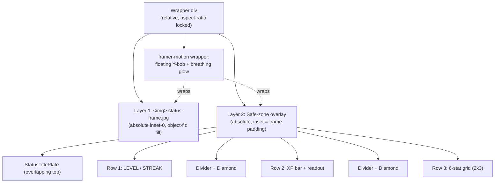

# Design Document: Hunter Status Window

## Overview

The Hunter Status Window is a pixel-faithful Solo Leveling "STATUS" panel that
replaces the Growth Terminal at the top of the dashboard. The first attempt
rendered the entire frame (chrome, distressed glass, glow, ornaments) inline
in SVG and failed to capture the painterly, ornate, glitch-textured aesthetic
of the SL anime status screen.

This design pivots to a **hybrid rendering pipeline**: the ornate outer frame
is delivered as a pre-rendered raster asset (`public/assets/status-frame.jpg`,
1024×583, opaque JPEG generated via Nano Banana to match the SL still), and
the inner data — STATUS title plate, level, XP bar, six cumulative stats — is
composited on top in HTML/CSS/SVG with translucent dark plates that let the
frame's shattered-glass texture bleed through. Reversibility is preserved
through the `HUNTER_STATUS_WINDOW_ENABLED` flag in `App.tsx`; the legacy
`PlayerStatusCard` is left untouched so the prior behavior can be restored
instantly.

The component lives at `components/HunterStatusWindow.tsx`, retains its
existing public surface (`{ player: PlayerData }`), and introduces no new
dependencies beyond the framer-motion + Tailwind stack already in use.

## Architecture

The window is composed of three stacked rendering layers inside a single
positioned wrapper. Layer order (back to front) is fixed; nothing in the
content layer is allowed to paint outside the safe-zone rectangle so the
frame's decorative bands and pillars are never overdrawn.



### Render Pipeline (visual order, back → front)

1. **Frame raster** — `` fills the wrapper
   at the wrapper's intrinsic aspect ratio. Opaque JPEG; no transparency
   needed because the inner content panels paint their own translucent dark
   tint.
2. **Safe-zone overlay container** — an absolutely-positioned `<div>` whose
   inset is computed from the frame's known padding (top/bottom decorative
   bands and side pillars). All readable content lives inside this rectangle.
3. **STATUS title plate** — a small bordered chip, centered, vertically
   straddling the top edge of the safe zone (overhangs by ~50% of its height)
   so it reads as overlapping the top decorative band, just like the SL still.
4. **Content rows** — three sections separated by hairline cyan dividers with
   small rotated-square diamond markers:
   - Row 1: Big LEVEL number left, STREAK label + count right.
   - Row 2: XP bar with `current / required` readout.
   - Row 3: 6-stat grid, 2 columns × 3 rows: STR/INT, DIS/SOC, FOC/WIL.
5. **Motion wrapper** — `framer-motion` `<motion.div>` wraps the entire stack
   and animates a subtle Y-translate and outer drop-shadow loop.

## Sequence Diagrams

### Mount and Render

```mermaid
sequenceDiagram
    participant App as App.tsx
    participant Flag as HUNTER_STATUS_WINDOW_ENABLED
    participant HSW as HunterStatusWindow
    participant Img as status-frame.jpg
    participant FM as framer-motion

    App->>Flag: read flag
    Flag-->>App: true
    App->>HSW: render &lt;HunterStatusWindow player={...} /&gt;
    HSW->>HSW: derive {level, xpPct, streak, stats} from props
    HSW->>FM: mount &lt;motion.div&gt; with float/glow keyframes
    HSW->>Img: request /assets/status-frame.jpg
    Img-->>HSW: 200 OK (cached after first paint)
    HSW->>HSW: paint safe-zone overlay + content rows
    FM-->>HSW: drive 6s animation loop
```

### Image Load Failure

```mermaid
sequenceDiagram
    participant HSW as HunterStatusWindow
    participant Img as status-frame.jpg
    participant Fallback as CSS fallback frame

    HSW->>Img: request /assets/status-frame.jpg
    Img--xHSW: 404 / network error / onError
    HSW->>HSW: setFrameLoaded(false)
    HSW->>Fallback: apply gradient + cyan border to wrapper
    Note over HSW,Fallback: Content remains fully readable;<br/>only ornate chrome is missing.
```

## Components and Interfaces

### Component: `HunterStatusWindow`

**Purpose**: Render the SL-style status panel over a raster frame asset.

**Props**:

```typescript
interface HunterStatusWindowProps {
  player: PlayerData; // existing dashboard player state
}
```

**Internal subcomponents** (all private to the file):

```typescript
// Hairline cyan divider with center diamond marker.
const Divider: React.FC;

// Single stat row: [icon] [label] : [value]
const StatRow: React.FC<{
  stat: keyof PlayerData['stats'];
  value: number;
}>;

// Bold filled white SVG glyph + white drop-shadow glow filter.
const StatIcon: React.FC<{ stat: keyof PlayerData['stats'] }>;
```

**Responsibilities**:

- Read `player.level`, `player.currentXp`, `player.requiredXp`, `player.streak`,
  `player.stats` and clamp them to safe display ranges.
- Render the three-layer stack (frame image, safe-zone overlay, content rows).
- Drive the floating animation via framer-motion.
- Detect frame image load failure and switch to the CSS fallback.
- Stay self-contained (no Suspense, no context, no async data fetching).

### Component: Frame Asset

**Path**: `public/assets/status-frame.jpg`

**Spec**:

| Property            | Value                                                         |
| ------------------- | ------------------------------------------------------------- |
| Dimensions          | 1024 × 583 px (≈ 1.756:1 aspect ratio)                        |
| Format              | JPEG, sRGB, opaque                                            |
| Source              | Generated via Nano Banana to match the SL anime status still  |
| Visual content      | Top/bottom decorative bands, side pillars, corner ornaments, distressed shattered-glass texture, magenta/purple energy glow |
| Padding (safe-zone) | top 14%, right 8%, bottom 14%, left 8% of intrinsic height/width |
| Cache headers       | Long-lived (immutable) — file is shipped with the build       |
| Fallback behavior   | If `` fires `onError`, hide the image and apply a CSS gradient frame |

**Padding rationale**: the user-supplied frame reserves roughly 14% of its
height for the top and bottom decorative bands and roughly 8% of its width
for the side pillars. Content placed inside this safe-zone never overlaps the
ornaments. Values are encoded as percentages so the safe zone scales 1:1 with
the frame at every viewport width.

### Reversibility Hook

`App.tsx` already gates the render through a local constant:

```typescript
const HUNTER_STATUS_WINDOW_ENABLED = true;
if (HUNTER_STATUS_WINDOW_ENABLED) {
  return <HunterStatusWindow player={player} />;
}
return <PlayerStatusCard {...legacyProps} />;
```

Flipping the flag to `false` instantly restores the legacy Growth Terminal.
The legacy component must not be edited or removed by this feature.

## Data Models

### `PlayerData` (consumed, already exists in `types.ts`)

```typescript
interface PlayerData {
  level: number;
  currentXp: number;
  requiredXp: number;
  streak: number;
  stats: CoreStats;
  // ... other fields not used by this component
}

interface CoreStats {
  strength: number;
  intelligence: number;
  discipline: number;
  social: number;
  focus: number;
  willpower: number;
}
```

**Rule (cumulative stats, not daily)**: this component reads the universal
`player.stats` totals — the values that grow with each completed quest or
workout and never reset. It does **not** read `dailyStats`, `weeklyStats`, or
`monthlyStats`.

### Local View Model (derived per render)

```typescript
interface ViewModel {
  level: number;       // max(1, player.level)
  currentXp: number;   // max(0, player.currentXp)
  requiredXp: number;  // max(1, player.requiredXp)
  xpPct: number;       // 0..100, integer, clamped
  streak: number;      // max(0, player.streak)
  stats: CoreStats;    // player.stats with each field defaulted to 0
}
```

**Validation rules**:

- All numeric fields are clamped to non-negative; non-finite values fall back
  to safe defaults (`0` or `1` for denominators).
- `xpPct = Math.min(100, Math.round((currentXp / requiredXp) * 100))`.
- Number formatting goes through `Math.floor` + `toLocaleString()` so large
  cumulative stat totals get thousands separators.

## Algorithmic Pseudocode

### Main Render Algorithm

```pascal
ALGORITHM renderHunterStatusWindow(player)
INPUT: player of type PlayerData
OUTPUT: React node

BEGIN
  ASSERT player IS NOT NULL

  // Step 1: derive the view model with clamps and defaults.
  vm ← deriveViewModel(player)
  ASSERT vm.requiredXp >= 1
  ASSERT vm.xpPct >= 0 AND vm.xpPct <= 100

  // Step 2: resolve frame asset state.
  frameLoaded ← stateRef(true)   // optimistic; flips to false onError

  // Step 3: assemble layered render tree.
  RETURN
    Wrapper(aspectRatio = 1024/583)
      MotionDiv(animate = floatingKeyframes, transition = 6s loop)
        IF frameLoaded THEN
          ImgLayer(src = "/assets/status-frame.jpg",
                   onError = () => frameLoaded ← false)
        ELSE
          FallbackGradientFrame()
        END IF

        SafeZoneOverlay(insetPct = {top: 14, right: 8, bottom: 14, left: 8})
          StatusTitlePlate(text = "STATUS", overhangTop = true)
          Row1_LevelStreak(level = vm.level, streak = vm.streak)
          DividerWithDiamond()
          Row2_XpBar(current = vm.currentXp,
                     required = vm.requiredXp,
                     pct = vm.xpPct)
          DividerWithDiamond()
          Row3_StatsGrid(stats = vm.stats)
        END SafeZoneOverlay
      END MotionDiv
    END Wrapper
END
```

**Preconditions**:

- `player` is the live dashboard player object.
- The asset at `/assets/status-frame.jpg` has been deployed with the build.
- Tailwind, framer-motion, and Rajdhani/Bai Jamjuree fonts are available.

**Postconditions**:

- Exactly one of {raster frame, CSS fallback frame} is painted.
- All readable content sits inside the safe zone — no glyph or plate is
  positioned outside the inset rectangle.
- The XP bar fill width equals `vm.xpPct`%.
- The animation loop runs continuously at 6s with `easeInOut`.

**Loop invariants**: N/A (no loops at the top level; `Row3_StatsGrid` iterates
over a fixed 6-element schema).

### View Model Derivation

```pascal
ALGORITHM deriveViewModel(player)
INPUT: player of type PlayerData
OUTPUT: vm of type ViewModel

BEGIN
  level       ← max(1, safeNumber(player.level, 1))
  currentXp   ← max(0, safeNumber(player.currentXp, 0))
  requiredXp  ← max(1, safeNumber(player.requiredXp, 100))
  streak      ← max(0, safeNumber(player.streak, 0))
  xpPct       ← min(100, round((currentXp / requiredXp) * 100))

  stats ← {
    strength:     max(0, safeNumber(player.stats.strength,     0)),
    intelligence: max(0, safeNumber(player.stats.intelligence, 0)),
    discipline:   max(0, safeNumber(player.stats.discipline,   0)),
    social:       max(0, safeNumber(player.stats.social,       0)),
    focus:        max(0, safeNumber(player.stats.focus,        0)),
    willpower:    max(0, safeNumber(player.stats.willpower,    0)),
  }

  RETURN { level, currentXp, requiredXp, xpPct, streak, stats }
END

PROCEDURE safeNumber(value, fallback)
  IF value IS NULL OR NOT isFinite(value) THEN
    RETURN fallback
  END IF
  RETURN value
END PROCEDURE
```

**Preconditions**: `player` is a `PlayerData` object; individual fields may be
missing or non-finite due to migration / legacy data.

**Postconditions**: every field of the returned `ViewModel` is finite,
non-negative, and within its rendering domain. `requiredXp >= 1`,
`0 <= xpPct <= 100`.

### Frame Image Failure Handling

```pascal
ALGORITHM handleFrameLoadFailure()
INPUT: imgError event
OUTPUT: void (state mutation)

BEGIN
  setFrameLoaded(false)
  // The wrapper re-renders with the CSS fallback frame.
  // Content rows are unaffected because they live in the safe-zone
  // overlay, which is independent of the frame layer.
END
```

**Postconditions**: the panel remains usable and readable; only the ornate
chrome is replaced with a plain gradient + cyan border.

## Key Functions with Formal Specifications

### `formatNum(n: number): string`

```typescript
function formatNum(n: number): string;
```

**Preconditions**: `n` is any value (including `NaN`, `Infinity`, negatives).

**Postconditions**:

- Returns a non-empty string of decimal digits with locale thousands separators.
- For non-finite or negative input, returns `"0"`.
- Never throws.

### `deriveViewModel(player: PlayerData): ViewModel`

**Preconditions**: `player` is a non-null `PlayerData` object.

**Postconditions**: as defined under Algorithmic Pseudocode → View Model
Derivation. Pure; no side effects on `player`.

### `StatIcon({ stat })`

**Preconditions**: `stat` is a key of `CoreStats`.

**Postconditions**:

- Returns a 16×16 SVG with `fill: #FFFFFF` (bold filled glyph, not outline).
- Applies `filter: url(#stat-icon-glow)` so the glyph carries a white drop-
  shadow halo identical to the SL reference.
- `aria-hidden="true"` on the SVG element.

## Example Usage

```typescript
// App.tsx — already in place; included for context.
const HUNTER_STATUS_WINDOW_ENABLED = true;

return HUNTER_STATUS_WINDOW_ENABLED ? (
  <ErrorBoundary fallbackLabel="Hunter Status Window failed">
    <HunterStatusWindow player={player} />
  </ErrorBoundary>
) : (
  <PlayerStatusCard {...legacyProps} />
);
```

```typescript
// HunterStatusWindow.tsx — usage of internal helpers.
const vm = deriveViewModel(player);
// vm.level === 7, vm.xpPct === 42, vm.stats.strength === 1240
<StatRow stat="strength" value={vm.stats.strength} />;
```

## Correctness Properties

The component is a pure projection of `PlayerData` into a layered visual tree.
The following invariants must hold for all valid `PlayerData` inputs:

1. **No NaN paint** — for every numeric value displayed (`level`, `streak`,
   `currentXp`, `requiredXp`, every `stats[k]`), the rendered text matches
   `formatNum(value)` and never contains `"NaN"`, `"Infinity"`, or `"-"`.

   ```typescript
   forall p: PlayerData,
     rendered(p) does not contain "NaN" | "Infinity" | "-Infinity"
   ```

2. **XP bar bounds** — the filled-bar width as a percentage is always within
   `[0, 100]`.

   ```typescript
   forall p: PlayerData,
     0 <= xpPctOf(p) <= 100
   ```

3. **Safe-zone containment** — every text node and divider has its bounding
   box fully contained inside the safe-zone rectangle defined by the frame
   padding percentages.

4. **Stat coverage** — exactly the six `CoreStats` keys are rendered, in the
   fixed order `[STR, INT, DIS, SOC, FOC, WIL]`. No more, no fewer.

5. **Reversibility** — toggling `HUNTER_STATUS_WINDOW_ENABLED` to `false`
   produces a tree identical to the pre-feature dashboard (same
   `PlayerStatusCard` props, same wrapping `Suspense`/`ErrorBoundary`).

6. **Asset independence** — content readability does not depend on the frame
   asset. If `status-frame.jpg` fails to load, all six stats, the level, the
   streak, and the XP bar remain visible and legible.

## Error Handling

### Scenario 1: Frame asset fails to load

**Condition**: `` fires `onError` (404, network failure, corrupt file).

**Response**: `setFrameLoaded(false)` toggles the wrapper into a CSS-only
fallback — a dark gradient background with a 1.5px cyan border and a soft
cyan box-shadow glow. The safe-zone overlay continues to render unchanged.

**Recovery**: the next mount retries the asset request. No user action
required.

### Scenario 2: `player` props missing or partial

**Condition**: a field in `PlayerData` is `undefined`, `null`, `NaN`, or
`Infinity` (e.g., during migration of legacy save data).

**Response**: `deriveViewModel` clamps each field through `safeNumber` and
substitutes a typed default (`level → 1`, `currentXp → 0`, `requiredXp → 100`,
`streak → 0`, every stat → `0`).

**Recovery**: visual rendering proceeds; values stabilize on the next render
once the upstream data is repaired.

### Scenario 3: Component throws during render

**Condition**: any unexpected runtime error inside `HunterStatusWindow`.

**Response**: the existing `<ErrorBoundary fallbackLabel="Hunter Status Window failed">`
in `App.tsx` catches the error and shows its standard fallback chip. The rest
of the dashboard remains interactive.

**Recovery**: the user can toggle `HUNTER_STATUS_WINDOW_ENABLED` to `false`
to restore the legacy `PlayerStatusCard` immediately.

## Testing Strategy

### Unit Testing Approach

- **`formatNum`** — table-driven tests covering: `0`, positive integers,
  negatives, `NaN`, `Infinity`, `-Infinity`, large values (`>= 1_000_000`),
  decimals (must floor).
- **`deriveViewModel`** — given partial `PlayerData` fixtures, assert the
  output never contains `NaN`/`Infinity`, all numbers are non-negative,
  `xpPct ∈ [0, 100]`, stat keys are all six `CoreStats` keys.
- **Render smoke** — mount with realistic, partial, and pathological props;
  assert that the rendered DOM contains the formatted level, streak, XP
  readout, and all six stat labels (`STR`, `INT`, `DIS`, `SOC`, `FOC`, `WIL`).

### Property-Based Testing Approach

Not strictly required for a presentational component, but recommended for
`deriveViewModel`:

**Property Test Library**: `fast-check` (already in repo dev deps if present;
otherwise this is optional and not blocking).

Properties:

- `forall player, deriveViewModel(player).xpPct ∈ [0, 100]`
- `forall player, deriveViewModel(player).requiredXp >= 1`
- `forall player, every numeric field of the result is finite and >= 0`

### Integration Testing Approach

- **Flag flip** — render `App.tsx` with `HUNTER_STATUS_WINDOW_ENABLED = false`
  and confirm the legacy `PlayerStatusCard` mounts (regression guard against
  accidentally breaking the rollback path).
- **Asset failure** — stub the `` to fire `onError` and assert the
  fallback frame renders while content remains visible.
- **Visual regression** — capture a screenshot at iPhone-12 (390px) and
  desktop (1280px) widths and compare against the SL reference still.

## Performance Considerations

- **Single static raster** — the frame is one ~150–250 KB JPEG, cached
  immutably by the browser; cheaper to paint than the previous SVG with
  multiple gradients, filters, and patterns.
- **Filters are scoped** — only the small `StatIcon` SVGs use a glow filter;
  the previous design's full-frame `<filter id="hsw-glow">` (which forced a
  large offscreen buffer) is gone.
- **Animation is composited** — the floating motion targets `transform`
  (`translateY`) and `filter: drop-shadow`, both of which are GPU-accelerated.
- **No re-layout on data change** — XP bar fill is a `width` transition on a
  positioned child, not a flex re-pack.
- **Image preload** — optional `<link rel="preload" as="image">` may be added
  to the dashboard route to avoid a flash of fallback frame on first paint.

## Security Considerations

- The frame asset is served same-origin from `public/assets`, eliminating
  third-party CDN/CORS concerns.
- No user-supplied content reaches the renderer; `formatNum` only emits
  digits, separators, and minus is suppressed by clamping.
- No HTML strings are interpolated; React JSX text nodes are escaped by
  default.

## Dependencies

| Dependency           | Purpose                                | Source               |
| -------------------- | -------------------------------------- | -------------------- |
| `react` (^18)        | Component runtime                      | Existing in repo     |
| `framer-motion`      | Floating Y-bob and breathing-glow loop | Existing in repo     |
| Tailwind CSS         | Layout utilities (sparingly)           | Existing in repo     |
| Rajdhani / Bai Jamjuree | Display fonts for digits/labels    | Existing in repo CSS |
| `public/assets/status-frame.jpg` | Pre-rendered SL-style frame chrome | New, shipped with build |

No new npm packages are introduced.

---

# Low-Level Design

## Component Tree

```
<div className="hsw-wrapper">                   // relative, aspect-ratio
  <motion.div className="hsw-motion">           // float + glow animation
    {frameLoaded ? (
                   // status-frame.jpg
    ) : (
      <div className="hsw-frame-fallback" />    // gradient + border
    )}

    <div className="hsw-safezone">              // inset overlay
      <div className="hsw-title-plate">STATUS</div>

      <div className="hsw-row hsw-row-level">
        <div className="hsw-level-block">
          <span className="hsw-level-num">{level}</span>
          <span className="hsw-level-label">LEVEL</span>
        </div>
        <div className="hsw-streak-block">
          <span className="hsw-streak-label">STREAK</span>
          <span className="hsw-streak-num">{streak}</span>
        </div>
      </div>

      <Divider />                                // hairline + diamond

      <div className="hsw-row hsw-row-xp">
        <span className="hsw-xp-label">XP</span>
        <div className="hsw-xp-bar">
          <div className="hsw-xp-bar-fill" />    // width: xpPct%
          <div className="hsw-xp-bar-ticks" />   // segmented overlay
        </div>
        <span className="hsw-xp-readout">
          <span className="hsw-xp-current">{currentXp}</span>
          <span className="hsw-xp-required"> / {requiredXp}</span>
        </span>
      </div>

      <Divider />

      <div className="hsw-stats-grid">           // 2 cols x 3 rows
        <StatRow stat="strength"     value={stats.strength}     />
        <StatRow stat="intelligence" value={stats.intelligence} />
        <StatRow stat="discipline"   value={stats.discipline}   />
        <StatRow stat="social"       value={stats.social}       />
        <StatRow stat="focus"        value={stats.focus}        />
        <StatRow stat="willpower"    value={stats.willpower}    />
      </div>
    </div>
  </motion.div>
</div>
```

## CSS Grid and Box Model (mobile-first)

Pixel values target a 360–414 px viewport (mobile-first) and scale via the
wrapper's aspect ratio.

### Wrapper

```text
.hsw-wrapper {
  position: relative;
  width: 100%;
  aspect-ratio: 1024 / 583;          /* matches frame asset */
  padding: 0;                        /* frame includes its own border */
  user-select: none;
}
```

### Frame layer

```text
.hsw-frame,
.hsw-frame-fallback {
  position: absolute;
  inset: 0;
  width: 100%;
  height: 100%;
  border-radius: 4px;
  pointer-events: none;
}
.hsw-frame      { object-fit: fill; }   /* JPEG fills wrapper */
.hsw-frame-fallback {
  background:
    linear-gradient(180deg, #060d18 0%, #02060c 100%);
  border: 1.5px solid #00d4ff;
  box-shadow:
    0 0 18px rgba(0, 212, 255, 0.35),
    inset 0 0 16px rgba(0, 212, 255, 0.08);
}
```

### Safe-zone overlay

```text
.hsw-safezone {
  position: absolute;
  top:    14%;
  right:   8%;
  bottom: 14%;
  left:    8%;
  display: flex;
  flex-direction: column;
  gap: 6px;
  padding: 4px 2px 2px;
  /* glass panel sits inside frame's etched glass texture */
  background: rgba(4, 10, 20, 0.55);
  backdrop-filter: blur(2px) saturate(110%);
  -webkit-backdrop-filter: blur(2px) saturate(110%);
  border-radius: 2px;
}
```

### STATUS title plate

```text
.hsw-title-plate {
  position: absolute;
  top: 0;
  left: 50%;
  transform: translate(-50%, -50%);   /* overhang half its height */
  padding: 4px 18px;
  background: rgba(4, 10, 20, 0.92);
  border: 1.5px solid #00d4ff;
  border-radius: 2px;
  box-shadow:
    0 0 10px rgba(0, 212, 255, 0.35),
    inset 0 0 8px rgba(0, 212, 255, 0.18);
  font-family: 'Rajdhani', 'Bai Jamjuree', sans-serif;
  font-weight: 800;
  font-size: 11px;
  letter-spacing: 0.32em;
  color: #ffffff;
  text-shadow: 0 0 6px rgba(0, 212, 255, 0.55);
}
```

### Row 1: LEVEL / STREAK

```text
.hsw-row-level {
  display: flex;
  align-items: center;
  justify-content: space-between;
  gap: 12px;
  padding: 8px 6px 4px;
}
.hsw-level-num {
  font-family: 'Rajdhani', sans-serif;
  font-weight: 800;
  font-size: 38px;        /* mobile baseline */
  line-height: 1;
  color: #ffffff;
  text-shadow:
    0 0 14px rgba(0, 212, 255, 0.85),
    0 0 4px rgba(255, 255, 255, 0.5);
}
.hsw-level-label,
.hsw-streak-label {
  font-family: 'Rajdhani', sans-serif;
  font-weight: 700;
  font-size: 10px;
  letter-spacing: 0.28em;
  color: rgba(220, 240, 250, 0.78);
}
.hsw-streak-num {
  font-family: 'Rajdhani', sans-serif;
  font-weight: 800;
  font-size: 20px;
  color: #ffffff;
  text-shadow: 0 0 10px rgba(0, 212, 255, 0.7);
}
```

### Row 2: XP bar

```text
.hsw-row-xp {
  display: grid;
  grid-template-columns: 24px 1fr 80px;
  align-items: center;
  gap: 10px;
  padding: 4px 6px;
}
.hsw-xp-label {
  font-family: 'Rajdhani', sans-serif;
  font-weight: 700;
  font-size: 10px;
  letter-spacing: 0.24em;
  color: rgba(220, 240, 250, 0.78);
  text-align: center;
}
.hsw-xp-bar {
  position: relative;
  height: 12px;
  background: rgba(0, 212, 255, 0.06);
  border: 1px solid rgba(0, 212, 255, 0.55);
  border-radius: 2px;
  overflow: hidden;
  box-shadow: inset 0 0 8px rgba(0, 212, 255, 0.10);
}
.hsw-xp-bar-fill {
  position: absolute;
  inset: 0;
  width: var(--xp-pct, 0%);
  background: linear-gradient(
    90deg,
    rgba(0, 212, 255, 0.55) 0%,
    rgba(140, 230, 255, 0.95) 100%
  );
  box-shadow:
    0 0 12px rgba(0, 212, 255, 0.55),
    inset 0 0 6px rgba(255, 255, 255, 0.4);
  transition: width 600ms cubic-bezier(0.22, 1, 0.36, 1);
}
.hsw-xp-bar-ticks {
  position: absolute;
  inset: 0;
  background: repeating-linear-gradient(
    90deg,
    transparent 0 16px,
    rgba(2, 8, 16, 0.55) 16px 17px
  );
  pointer-events: none;
}
.hsw-xp-readout {
  font-family: 'Rajdhani', sans-serif;
  font-weight: 600;
  font-size: 11px;
  text-align: right;
}
.hsw-xp-current  { color: #ffffff; text-shadow: 0 0 6px rgba(0, 212, 255, 0.6); }
.hsw-xp-required { color: rgba(220, 240, 250, 0.55); }
```

### Row 3: 6-stat grid

```text
.hsw-stats-grid {
  display: grid;
  grid-template-columns: 1fr 1fr;
  grid-template-rows: repeat(3, auto);
  column-gap: 22px;
  row-gap: 8px;
  padding: 8px 6px 0;
}
.hsw-stat-row {
  display: grid;
  grid-template-columns: 18px 1fr 8px auto;
  align-items: center;
  gap: 8px;
}
.hsw-stat-icon  { width: 14px; height: 14px; }
.hsw-stat-label {
  font-family: 'Rajdhani', sans-serif;
  font-weight: 700;
  font-size: 11px;
  letter-spacing: 0.2em;
  color: rgba(220, 240, 250, 0.78);
}
.hsw-stat-colon { color: rgba(220, 240, 250, 0.55); }
.hsw-stat-value {
  font-family: 'Rajdhani', sans-serif;
  font-weight: 800;
  font-size: 15px;
  color: #ffffff;
  text-shadow: 0 0 10px rgba(0, 212, 255, 0.75);
  text-align: right;
  min-width: 30px;
}
```

### Divider

```text
.hsw-divider {
  position: relative;
  height: 1px;
  margin: 4px 8px;
  background: linear-gradient(
    90deg,
    transparent 0%,
    rgba(0, 212, 255, 0.55) 50%,
    transparent 100%
  );
}
.hsw-divider::after {
  content: '';
  position: absolute;
  top: -3px;
  left: 50%;
  width: 6px;
  height: 6px;
  transform: translateX(-50%) rotate(45deg);
  background: #00d4ff;
  box-shadow: 0 0 8px #00d4ff;
}
```

## SVG Icon Specs

All six icons share a common spec for visual coherence with the SL still:
**bold filled white glyphs** with a soft white drop-shadow halo. No outlines.

### Common attributes

```text
viewBox:        "0 0 24 24"
width / height: 14 (mobile) / 16 (>=480px)
fill:           #ffffff
stroke:         none
filter:         url(#hsw-icon-glow)
aria-hidden:    true
```

### Shared filter (declared once at the top of the component)

```xml
<filter id="hsw-icon-glow" x="-50%" y="-50%" width="200%" height="200%">
  <feGaussianBlur stdDeviation="0.8" result="blur" />
  <feFlood flood-color="#ffffff" flood-opacity="0.85" />
  <feComposite in2="blur" operator="in" result="glow" />
  <feMerge>
    <feMergeNode in="glow" />
    <feMergeNode in="SourceGraphic" />
  </feMerge>
</filter>
```

### Glyph paths (filled, 24×24)

| Stat         | Glyph          | Path (pseudocode)                                         |
| ------------ | -------------- | --------------------------------------------------------- |
| strength     | filled fist/bolt | `M12 2 L20 11 L14 11 L18 22 L4 12 L10 12 L6 2 Z`        |
| intelligence | filled brain dot cluster | filled circle r=8 minus inner ring + central dot |
| discipline   | filled shield  | `M12 2 L21 6 V12 C21 17 12 22 12 22 C12 22 3 17 3 12 V6 Z` |
| social       | two filled overlapping circles | `M9 9 m-5 0 a5 5 0 1 0 10 0 a5 5 0 1 0 -10 0` + mirrored at (15,15) |
| focus        | filled crosshair | filled circle r=4 + cross arms `M12 1 V6 M12 18 V23 M1 12 H6 M18 12 H23` |
| willpower    | filled flame   | `M12 22 C7 22 4 18 4 14 C4 9 8 6 9 1 C11 5 14 6 17 9 C20 12 20 18 17 20 C15 22 14 22 12 22 Z` |

All values get the same glow filter so the row reads consistently.

## Animation Keyframes & Timings

Driven by framer-motion on the `.hsw-motion` wrapper:

```typescript
animate={{
  y: [0, -3, 0, 3, 0],
  filter: [
    'drop-shadow(0 0 18px rgba(0,212,255,0.22)) drop-shadow(0 8px 32px rgba(0,0,0,0.6))',
    'drop-shadow(0 0 26px rgba(0,212,255,0.55)) drop-shadow(0 12px 36px rgba(0,0,0,0.6))',
    'drop-shadow(0 0 18px rgba(0,212,255,0.22)) drop-shadow(0 8px 32px rgba(0,0,0,0.6))',
  ],
}}
transition={{ duration: 6, repeat: Infinity, ease: 'easeInOut' }}
```

| Property | Range / Value | Loop |
| -------- | ------------- | ---- |
| `y` (translateY) | 0 → -3 → 0 → +3 → 0 px | 6s, easeInOut, infinite |
| outer cyan halo  | 18px @ 0.22 → 26px @ 0.55 → 18px @ 0.22 | 6s, easeInOut, infinite |
| outer dark drop  | 8px → 12px → 8px black @ 0.6 | 6s, easeInOut, infinite |
| XP fill width    | `width: var(--xp-pct)` | 600ms cubic-bezier(0.22, 1, 0.36, 1) on data change |

Respect `prefers-reduced-motion`:

```text
@media (prefers-reduced-motion: reduce) {
  .hsw-motion { animation: none !important; }
  .hsw-xp-bar-fill { transition: none; }
}
```

## Color Tokens

```typescript
const HSW_TOKENS = {
  // Cyan family
  CYAN:         '#00d4ff',
  CYAN_DIM:     'rgba(0, 212, 255, 0.55)',
  CYAN_FAINT:   'rgba(0, 212, 255, 0.22)',
  CYAN_SOFT:    'rgba(0, 212, 255, 0.08)',

  // Magenta accents (used in frame asset; tokens kept for parity)
  MAGENTA:      '#d000ff',
  MAGENTA_DIM:  'rgba(208, 0, 255, 0.35)',

  // Glass panel fills
  PANEL_BG:     'rgba(4, 10, 20, 0.55)',   // safe-zone overlay
  PLATE_BG:     'rgba(4, 10, 20, 0.92)',   // STATUS title plate

  // Text
  TEXT_WHITE:   '#ffffff',
  TEXT_LABEL:   'rgba(220, 240, 250, 0.78)',
  TEXT_DIM:     'rgba(220, 240, 250, 0.55)',

  // Glows
  WHITE_GLOW:   'rgba(255, 255, 255, 0.5)',
  CYAN_GLOW:    'rgba(0, 212, 255, 0.85)',
};
```

**Translucency mix rule**: every glass-style panel uses
`background: rgba(4,10,20, α)` where α ∈ {0.55 (safe-zone), 0.92 (title plate)}
combined with `backdrop-filter: blur(2px) saturate(110%)`. This lets the
frame's distressed-glass texture bleed through subtly without competing with
the foreground numbers.

## Responsive Media Queries

Mobile-first. The wrapper's aspect ratio drives the overall scale; specific
font and gap sizes step up at common breakpoints.

```text
/* Default: 360–479 px (small phones) */
.hsw-level-num    { font-size: 36px; }
.hsw-streak-num   { font-size: 18px; }
.hsw-stat-value   { font-size: 14px; }
.hsw-title-plate  { font-size: 10px; padding: 3px 14px; }
.hsw-stat-icon    { width: 12px; height: 12px; }

/* >= 480px (large phones / phablets) */
@media (min-width: 480px) {
  .hsw-level-num   { font-size: 42px; }
  .hsw-streak-num  { font-size: 22px; }
  .hsw-stat-value  { font-size: 16px; }
  .hsw-title-plate { font-size: 11px; padding: 4px 18px; }
  .hsw-stat-icon   { width: 14px; height: 14px; }
}

/* >= 768px (tablet) */
@media (min-width: 768px) {
  .hsw-level-num   { font-size: 56px; }
  .hsw-streak-num  { font-size: 26px; }
  .hsw-stat-value  { font-size: 18px; }
  .hsw-title-plate { font-size: 12px; padding: 5px 22px; letter-spacing: 0.34em; }
  .hsw-stat-icon   { width: 16px; height: 16px; }
  .hsw-stats-grid  { column-gap: 32px; row-gap: 10px; }
}

/* >= 1024px (desktop) */
@media (min-width: 1024px) {
  .hsw-level-num   { font-size: 64px; }
  .hsw-stats-grid  { column-gap: 40px; }
}

/* Reduced motion */
@media (prefers-reduced-motion: reduce) {
  .hsw-motion       { transform: none !important; }
  .hsw-xp-bar-fill  { transition: none !important; }
}
```

## Asset Spec Summary (recap)

| Field        | Value                                                       |
| ------------ | ----------------------------------------------------------- |
| Path         | `public/assets/status-frame.jpg`                            |
| Dimensions   | 1024 × 583 px                                                |
| Aspect ratio | ≈ 1.756 : 1 (encoded as `aspect-ratio: 1024 / 583` on wrapper) |
| Format       | JPEG, sRGB, opaque                                          |
| Safe-zone    | top 14%, right 8%, bottom 14%, left 8%                      |
| Fallback     | CSS gradient + cyan border + soft glow when `` errors  |
| Cache        | Immutable; ships with the build                             |

## File Layout

```
solo-leveling/
├── components/
│   └── HunterStatusWindow.tsx           ← rewritten (single file)
├── public/
│   └── assets/
│       └── status-frame.jpg             ← new asset (already in repo)
└── App.tsx                              ← unchanged; flag already in place
```

No edits to `PlayerStatusCard.tsx` or any other component. Reverting is a
single-line change to `HUNTER_STATUS_WINDOW_ENABLED`.
